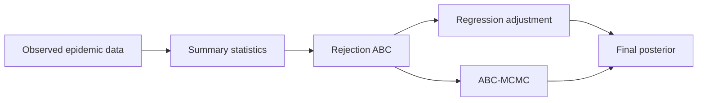
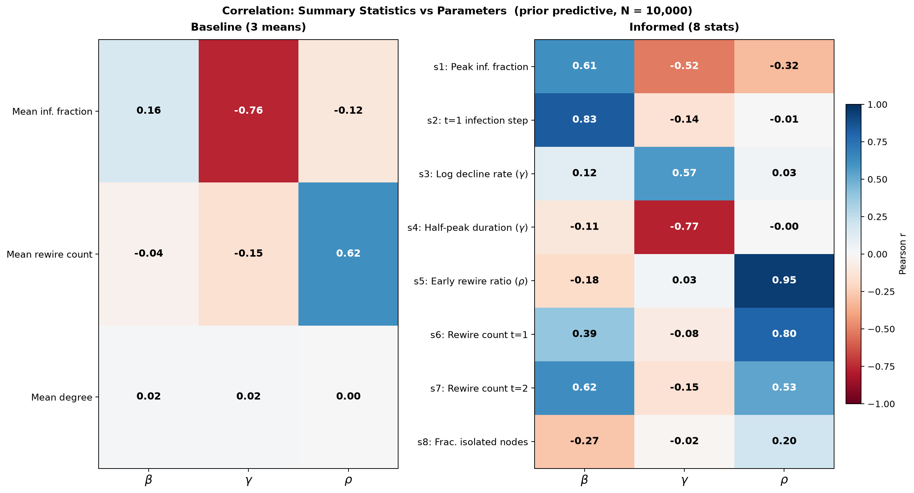

# ST3247 Simulation — Adaptive-Network SIR Inference

**National University of Singapore** · Department of Statistics and Data Science  
**Module:** [ST3247 Simulation](https://nusmods.com/courses/ST3247/simulation)  
**Instructor:** [Assoc. Prof. Alexandre Thiéry](https://alexxthiery.github.io/)  
**Project brief:** [Simulation-Based Inference for an Adaptive-Network Epidemic Model](https://alexxthiery.github.io/teaching/SBI_infection/SBI-infection.html)

Group project by **Maksymilian Paczyński** and **Ruofei Fang**.

---

## Overview

This repository is the **group project** for [ST3247 Simulation](https://nusmods.com/courses/ST3247/simulation) under **Assoc. Prof. Alexandre Thiéry**: infer \((\beta,\gamma,\rho)\) for an adaptive-network SIR epidemic when the likelihood is intractable, using **ABC** and related simulation-based methods (Python / NumPy).

**Deliverables:** `report.pdf` + `simulator.ipynb` (marking: 70% report · 30% code).

| Parameter | Meaning | Prior |
|---|---|---|
| β | Infection probability per S–I edge per step | Uniform(0.05, 0.50) |
| γ | Recovery probability per infected node per step | Uniform(0.02, 0.20) |
| ρ | Rewiring probability per S–I edge per step | Uniform(0.0, 0.8) |

**Final estimates** (regression-adjusted ABC, ε = 10%):

| Parameter | Median | 95% credible interval | Shrinkage |
|---|---:|---|---:|
| β | 0.176 | [0.108, 0.284] | 0.664 |
| γ | 0.089 | [0.066, 0.119] | 0.747 |
| ρ | 0.316 | [0.244, 0.393] | 0.834 |

Informed 8-statistic design resolves the β–ρ confound: posterior correlation \(r(\beta,\rho) = 0.071\) at ε = 5% (vs 0.818 for naive temporal means).



<p align="center">
  
</p>
<p align="center"><em>Baseline vs informed summary–parameter correlations (prior predictive, N = 10,000).</em></p>

---

## Repository layout

```text
.
├── report.pdf              # Final project report (primary deliverable)
├── report.tex              # LaTeX source
├── references.bib
├── simulator.ipynb         # Full analysis pipeline (exploration → ABC → reg-adj → MCMC)
├── data/                   # Observed trajectories (40 replicates)
│   ├── infected_timeseries.csv
│   ├── rewiring_timeseries.csv
│   └── final_degree_histograms.csv
└── graphics/               # Figures embedded in the report
```

Large simulation caches (`*.npz`) are gitignored and regenerated on first run.

---

## What we did

1. **Rejection ABC** — 10,000 prior simulations; baseline vs informed summary statistics; identifiability via \(|r(\beta,\rho)| < 0.3\).
2. **Summary-statistic design** — eight mechanistic probes exploiting Infection → Recovery → Rewiring phase order (pure-β first step, early rewire ratio for ρ, post-peak decay for γ).
3. **Regression adjustment** (Beaumont, Zhang & Balding, 2002) — primary reported posterior.
4. **ABC-MCMC** (Marjoram et al., 2003) — independent cross-check at a tighter tolerance.
5. **Validation** — synthetic-truth recovery and posterior predictive checks.

---

## How to reproduce

```bash
# 1. Clone
git clone https://github.com/makspacz12/adaptive-network-sir-abc.git
cd adaptive-network-sir-abc

# 2. Open and run the notebook (Python 3 + numpy, pandas, matplotlib, scikit-learn)
jupyter notebook simulator.ipynb
```

On first run the notebook builds a prior bank of 10,000 simulations (~several minutes) and caches it under `data/`. ABC-MCMC is the slowest step (~1–2 hours with the notebook settings).

Rebuild the PDF (optional):

```bash
# requires a TeX distribution (e.g. TeX Live / MiKTeX / tectonic)
pdflatex report.tex && bibtex report && pdflatex report.tex && pdflatex report.tex
```

---

## Authors

- Maksymilian Paczyński  
- Ruofei Fang  

Group project for **ST3247 Simulation**, NUS, under **Assoc. Prof. Alexandre Thiéry**.

**Grade obtained: A (Honours)**

---

## References (selected)

- Gross, T., D’Lima, C. J. D., & Blasius, B. (2006). Epidemic dynamics on an adaptive network. *PRL*.  
- Beaumont, M. A., Zhang, W., & Balding, D. J. (2002). Approximate Bayesian computation in population genetics. *Genetics*.  
- Marjoram, P. et al. (2003). Markov chain Monte Carlo without likelihoods. *PNAS*.  
- Course page: [alexxthiery.github.io/teaching/SBI_infection](https://alexxthiery.github.io/teaching/SBI_infection/SBI-infection.html)

Full bibliography: `references.bib`.
