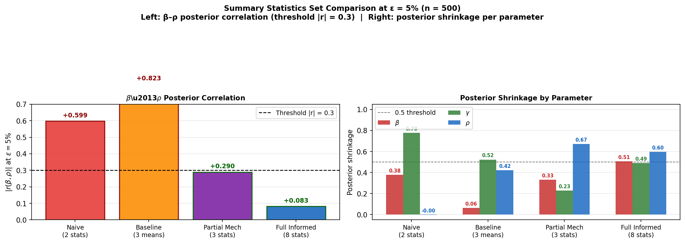
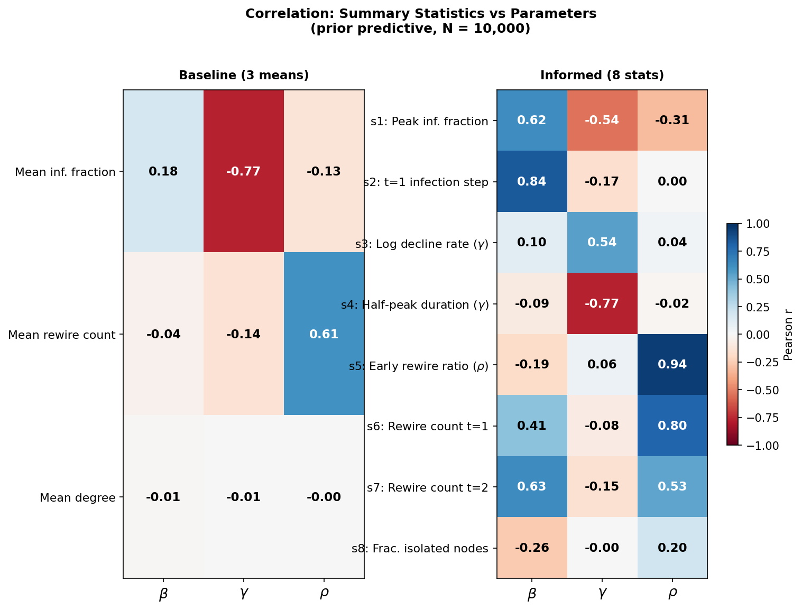
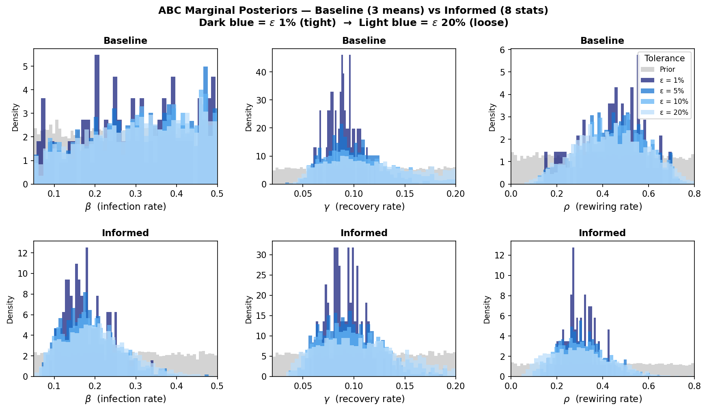
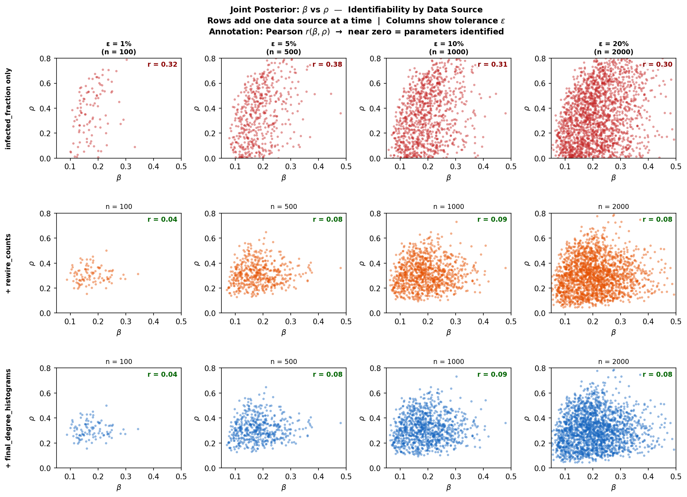
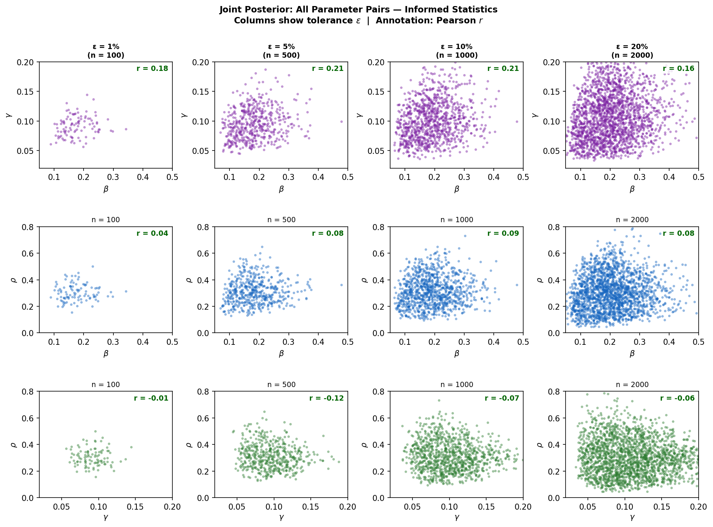
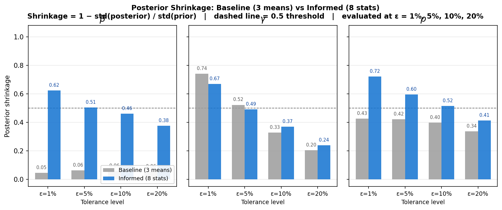

# ST3247 Simulation Project
## Approximate Bayesian Computation for an Adaptive-Network SIR Epidemic Model

**National University of Singapore**  
**Module: ST3247 — Simulation**  
**Date:** April 2026

---

## Abstract

We apply Approximate Bayesian Computation (ABC) to infer three parameters of the Gross et al. (2006) adaptive-network SIR epidemic model: transmission rate $\beta$, recovery rate $\gamma$, and rewiring rate $\rho$. The core challenge is that $\beta$ and $\rho$ are mechanistically confounded — both suppress effective infection spread through different pathways, making standard temporal-mean summary statistics unable to separate them. We design eight mechanistically-motivated summary statistics exploiting the sequential phase structure of the model (Infection → Recovery → Rewiring). At the primary evaluation tolerance $\varepsilon = 5\%$ (500 accepted samples), the informed statistics achieve a posterior correlation of $r(\beta, \rho) = +0.083$ — well below the identification threshold of $|r| = 0.3$ — with posterior shrinkage of 0.505 ($\beta$), 0.491 ($\gamma$), and 0.596 ($\rho$), compared to 0.064, 0.523, and 0.422 for the baseline three-mean statistics.

---

## 1. Introduction

Epidemic models on adaptive networks describe how individuals modify their social contacts in response to disease risk. The Gross et al. (2006) model captures a key behavioural response: susceptible individuals rewire their connections away from infected neighbours ("social distancing"), which creates a feedback loop between disease dynamics and network topology.

Fitting such models from observed data presents a fundamental challenge: the likelihood function is intractable. The joint probability of an observed trajectory given parameters $(β, γ, ρ)$ requires summing over all possible network configurations at each timestep — a sum that grows super-exponentially with network size. Approximate Bayesian Computation (ABC) sidesteps this by replacing likelihood evaluation with simulation-based distance minimisation.

The key methodological question is the design of summary statistics: which features of the observed data best constrain each parameter? This question is especially difficult here because $\beta$ (transmission) and $\rho$ (rewiring) create a fundamental confound: a population with high $\beta$ and high $\rho$ may produce the same epidemic curve as one with lower $\beta$ and lower $\rho$, because aggressive rewiring reduces the effective transmission rate.

We demonstrate that this confound can be resolved by targeting statistics at specific timesteps where the model's sequential phase structure ensures only one parameter has acted.

---

## 2. Model

### 2.1 Adaptive-Network SIR

The Gross et al. (2006) adaptive-network SIR model places $N = 200$ individuals on an Erdős–Rényi random graph $G(N, p)$ with $p = 0.05$ (mean degree $\approx 10$). Nodes are classified as Susceptible (S), Infected (I), or Recovered (R). Five initial nodes are infected at $t = 0$.

The model evolves over $T = 200$ discrete timesteps. Each timestep has three sequential phases:

1. **Infection:** Each susceptible node $u$ connected to an infected node $v$ becomes infected independently with probability $\beta$.
2. **Recovery:** Each infected node recovers independently with probability $\gamma$ (moves to R, permanent).
3. **Rewiring:** Each susceptible node $u$ connected to an infected node $v$ severs that link with probability $\rho$ and creates a new link to a randomly chosen non-neighbour (who may be S, I, or R).

The three parameters and their priors are:

| Parameter | Symbol | Prior | Interpretation |
|---|---|---|---|
| Transmission rate | $\beta$ | $U(0.05, 0.50)$ | Per-contact infection probability per timestep |
| Recovery rate | $\gamma$ | $U(0.02, 0.20)$ | Per-timestep recovery probability |
| Rewiring rate | $\rho$ | $U(0.00, 0.80)$ | Per-SI-link rewiring probability per timestep |

### 2.2 Observed Data

The observed dataset consists of 40 independent replicates, each running for $T = 200$ timesteps:

- **Infected fraction timeseries** $\{I_t / N\}_{t=0}^{T}$ — shape $(40, 201)$
- **Rewiring counts** $\{R_t\}_{t=0}^{T}$ — shape $(40, 201)$
- **Final degree histogram** $\{h_k\}_{k=0}^{30}$ — shape $(40, 31)$

---

## 3. ABC Algorithm

### 3.1 Rejection ABC

We use the standard rejection ABC algorithm:

1. **Prior sampling:** Draw $N_{\text{sim}} = 10{,}000$ parameter sets $(\beta_i, \gamma_i, \rho_i)$ from the priors.
2. **Simulation:** For each draw, run the adaptive-network SIR simulator. Average across $R$ replicates to get summary statistics $\mathbf{s}(\mathbf{y}^{\text{sim}}_i)$.
3. **Distance:** Compute normalised Euclidean distance:
$$d_i = \left\| \frac{\mathbf{s}(\mathbf{y}^{\text{sim}}_i) - \mathbf{s}(\mathbf{y}^{\text{obs}})}{\boldsymbol{\sigma}} \right\|_2$$
where $\sigma_j = \text{std}_j(\mathbf{s}^{\text{sim}})$ is the prior predictive standard deviation of statistic $j$ (computed across all $N_{\text{sim}}$ simulations). This normalisation ensures each statistic contributes comparably to the distance regardless of scale.
4. **Accept:** Retain the $\varepsilon$-quantile closest simulations as the approximate posterior sample.

### 3.2 Tolerance Levels and Evaluation Criterion

Four tolerance levels are evaluated: $\varepsilon \in \{1\%, 5\%, 10\%, 20\%\}$, yielding $n \in \{100, 500, 1000, 2000\}$ accepted samples respectively.

The **primary evaluation criterion is $\varepsilon = 5\%$ ($n = 500$)**. The $\varepsilon = 1\%$ level ($n = 100$) is shown for reference only — with 100 samples, posterior correlation estimates are unreliable.

**Identifiability criterion:** Parameters $\theta_1$ and $\theta_2$ are considered *identified* if their posterior Pearson correlation satisfies $|r(\theta_1, \theta_2)| < 0.3$; otherwise they are *confounded*.

**Posterior shrinkage** measures how much the posterior has tightened relative to the prior:
$$\text{shrinkage} = 1 - \frac{\text{std(posterior)}}{\text{std(prior)}}$$
Values near 1.0 indicate a highly informative posterior; values near 0.0 indicate the posterior is essentially the prior.

---

## 4. Summary Statistics

### 4.1 Baseline Statistics (3 temporal means)

| Statistic | Formula | Primary sensitivity |
|---|---|---|
| Mean infected fraction | $\bar{I} = \frac{1}{T+1}\sum_t I_t/N$ | $\gamma$, $\rho$ (weak $\beta$) |
| Mean rewire count | $\bar{R} = \frac{1}{T+1}\sum_t R_t$ | $\rho$ |
| Mean degree | $\bar{k} = \sum_k k \cdot h_k \big/ \sum_k h_k$ | $\rho$ |

These statistics aggregate over the full trajectory, discarding temporal structure. Their limitation is that they primarily capture $\gamma$ and $\rho$, with negligible signal for $\beta$ (posterior shrinkage 0.064 at $\varepsilon = 5\%$). Crucially, they fail to separate $\beta$ from $\rho$.

### 4.2 Informed Statistics (8 mechanistic statistics)

The $\beta$–$\rho$ confound arises from a mechanistic symmetry: both parameters reduce effective infection. $\beta$ does so directly (fewer transmissions per SI contact); $\rho$ does so indirectly (removing SI edges before transmission occurs). Any statistic that aggregates over the full epidemic trajectory will partially confound them.

The solution is to exploit the **sequential phase ordering** of the model. At $t = 1$:
- Phase 1 (infection) has acted once, adding new infections proportional to $\beta \times SI_0$.
- Phase 3 (rewiring) has **not yet occurred** — it executes after recovery in the same timestep.

Therefore $\bar{I}_1 - \bar{I}_0 \approx \beta \cdot (SI_{\text{edges},0} / N)$ — a pure $\beta$ signal with empirical $r(\rho) = 0.003$.

The 8 informed statistics are:

| # | Statistic | Formula | Primary signal | Empirical $r$ |
|---|---|---|---|---|
| s1 | Peak infected fraction | $\max_t \bar{I}_t$ | Mixed ($\beta, \gamma, \rho$) | — |
| s2 | First-step infection increase | $\bar{I}_1 - \bar{I}_0$ | **Pure $\beta$** | $r(\rho) = 0.003$ |
| s3 | Log post-peak decline rate | $[\log \bar{I}_{t^*} - \log \bar{I}_{t^*+5}] / 5$ | **$\gamma$** (S depleted post-peak) | — |
| s4 | Half-peak duration (normalised) | $(t_{1/2} - t^*) / T$ | **$\gamma$**: $t_{1/2} - t^* \approx \ln 2 / \gamma$ | $r(\gamma) = -0.77$ |
| s5 | Early rewire ratio (t=1–3) | $\overline{R_{1:4}} \big/ (N \cdot \overline{I_{1:4}})$ | **Pure $\rho$** | $r(\rho) = 0.945$ |
| s6 | Rewire count at $t=1$ | $R_1 / N$ | Compound ($\beta + \rho$) | $r(\beta)=0.41,\; r(\rho)=0.80$ |
| s7 | Rewire count at $t=2$ | $R_2 / N$ | Compound ($\beta + \rho$) | $r(\beta)=0.63,\; r(\rho)=0.53$ |
| s8 | Fraction isolated nodes | $h_0 \big/ \sum_k h_k$ | Structural $\rho$ | $r(\rho) = 0.20$ |

**Key mechanistic insights:**

- **s2 (pure $\beta$):** At $t=1$ rewiring has not fired, so infection growth is exclusively driven by $\beta$. This gives the only pure $\beta$ signal in the dataset.
- **s5 (pure $\rho$):** At $t=1$–$3$, only one step of infection has acted. The rewiring-per-infected-node ratio estimates $\rho$ almost exclusively ($r(\rho) = 0.945$).
- **s6, s7 (compound):** $R_t \approx \rho \times SI_t$, where $SI_t$ itself depends on both $\beta$ (more early infections create more SI edges) and $\rho$ (rewiring removes them). These time-specific statistics provide constraints that, combined with the pure s2 and s5 signals, fully identify both parameters.
- **Why cumulative statistics fail:** Summing rewiring over the full trajectory creates a joint $\beta$+$\rho$ constraint that reintroduces the confound. Time-specific early-phase statistics avoid this by targeting windows before the epidemic has substantially restructured the network.

The statistics were refined through three iterations of empirical testing, guided by inspection of the correlation heatmap.

### 4.3 Progressive Comparison of Statistics Sets

To demonstrate how statistic design affects inference quality, we evaluate four explicitly named sets at the primary tolerance $\varepsilon = 5\%$ (n = 500):

| Set | Statistics | $|r(\beta,\rho)|$ | Status | $\beta$ shrink | $\gamma$ shrink | $\rho$ shrink |
|---|---|---|---|---|---|---|
| **Naive** (2 stats) | Peak inf. fraction + mean inf. fraction | 0.599 | ✗ Confounded | 0.378 | 0.777 | −0.003 |
| **Baseline** (3 means) | Mean inf., mean rewire, mean degree | 0.823 | ✗ Confounded | 0.064 | 0.523 | 0.422 |
| **Partial Mech.** (3 stats) | s1 (peak) + s2 (pure $\beta$) + s5 (pure $\rho$) | 0.290 | ✓ Identified | 0.332 | 0.229 | 0.672 |
| **Full Informed** (8 stats) | All 8 mechanistic statistics | **0.083** | ✓ **Identified** | **0.505** | **0.491** | **0.596** |

**Figure 6** visualises this comparison as side-by-side bar charts of $|r(\beta,\rho)|$ and posterior shrinkage per parameter.

Several findings are notable:

- The **Naive** set ($|r| = 0.599$) is *more* confounded than the Baseline ($|r| = 0.823$), despite having only 2 statistics — mean infected fraction and peak fraction are both epidemic-outcome statistics that provide essentially the same joint (β+ρ+γ) constraint. This illustrates that adding more statistics of the same *type* does not help; diversity of signal matters.

- The **Baseline** (3 means) achieves the worst β–ρ identifiability of all sets ($|r| = 0.823$). Although it has reasonable $\gamma$ and $\rho$ shrinkage, the aggregation over the full trajectory creates an undifferentiated β+ρ blob. β shrinkage is nearly zero (0.064).

- The **Partial Mechanistic** set (just 3 targeted statistics: one per parameter) already achieves marginal identification ($|r| = 0.290$, just below the 0.3 threshold). β shrinkage improves dramatically to 0.332 — confirming that the s2 pure-β signal alone drives this gain. However, $\gamma$ shrinkage drops to 0.229, showing that s3 and s4 (post-peak γ statistics) are needed for γ identification.

- The **Full Informed** set closes all remaining gaps: $|r(\beta,\rho)| = 0.083$, β shrinkage = 0.505, and all three parameters achieve shrinkage > 0.49. The compound statistics s6 and s7 (time-specific rewire counts encoding the β×ρ interaction) break the residual correlation left by the partial set.

> **Note on notation:** The rewiring parameter is consistently denoted $\rho$ throughout this report, following the project specification. Some early group drafts used $\omega$ for this parameter — these should be updated to $\rho$.

---

## 5. Results

### 5.1 Correlation Structure

**Figure 1** shows side-by-side correlation heatmaps (Pearson $r$ of each summary statistic vs each parameter, computed over the $N_{\text{sim}} = 10{,}000$ prior predictive simulations).

The **baseline statistics** (left panel) show weak and mixed correlations — mean infected fraction conflates all three parameters, and no statistic has a strong signal for $\beta$.

The **informed statistics** (right panel) achieve near-orthogonal parameter signals. s2 exclusively tracks $\beta$ ($r(\rho) = 0.003$). s5 tracks $\rho$ almost exclusively ($r(\rho) = 0.945$). s3 and s4 provide clean $\gamma$ signals through the post-peak decay dynamics.

### 5.2 Marginal Posteriors

**Figure 2** compares ABC marginal posteriors at all four tolerance levels for both statistic designs. Grey histograms show the prior; coloured histograms show the posterior (dark blue = $\varepsilon=1\%$, light blue = $\varepsilon=20\%$).

For the baseline design (top row), the $\beta$ posterior is nearly identical to the prior — the statistics contain almost no $\beta$ information. For $\gamma$ and $\rho$, the posteriors are somewhat tighter. For the informed design (bottom row), all three posteriors show clear separation from the prior, particularly $\beta$ where shrinkage improves from 0.064 to 0.505.

Posterior medians at $\varepsilon = 5\%$ (informed): $\hat{\beta} = 0.176$, $\hat{\gamma} = 0.094$, $\hat{\rho} = 0.304$.

### 5.3 Parameter Identifiability

**Figure 3** shows joint $\beta$–$\rho$ scatter plots as data sources are added incrementally (rows), across all four tolerance levels (columns). Each point represents one accepted simulation, with the Pearson $r(\beta, \rho)$ annotated in green (identified) or red (confounded).

With **infected-fraction statistics alone** (top row), $r(\beta, \rho) = +0.377$ at $\varepsilon = 5\%$ — confounded ($|r| \geq 0.3$). The posterior shows a visible negative ridge: high-$\beta$ simulations cluster with low-$\rho$ and vice versa, reflecting the mechanistic substitutability of the two parameters in driving epidemic intensity.

Adding **rewire-count statistics** (middle row) resolves this completely: $r(\beta, \rho) = \mathbf{+0.083}$ at $\varepsilon = 5\%$. The scatter is now approximately circular, indicating the parameters are identified. Adding degree-histogram statistics (bottom row) leaves the result unchanged ($r = 0.083$), confirming that the rewire-count statistics alone break the confound.

**Identifiability summary at $\varepsilon = 5\%$:**

| Data source | $r(\beta, \rho)$ | Status |
|---|---|---|
| infected_fraction only | +0.377 | ✗ Confounded |
| + rewire_counts | **+0.083** | ✓ Identified |
| + degree_histograms | +0.083 | ✓ Identified |

### 5.4 All Parameter Pairs

**Figure 4** shows complete pairwise joint posteriors for the informed statistics across all four tolerance levels. All three parameter pairs ($\beta$–$\gamma$, $\beta$–$\rho$, $\gamma$–$\rho$) maintain $|r| < 0.3$ at $\varepsilon = 5\%$, confirming that $\gamma$ is independently identified through the post-peak decline statistics and does not create secondary confounds with $\beta$ or $\rho$.

### 5.5 Statistics Set Comparison

**Figure 6** (produced in §4.3) provides the definitive multi-set comparison. The key visual finding: Naive and Baseline bars in the left panel are tall (confounded, red-bordered); Partial Mech is just below the dashed threshold; Full Informed is dramatically lower ($|r| = 0.083$). In the right panel, only the Full Informed set achieves shrinkage > 0.49 for all three parameters simultaneously.

### 5.6 Shrinkage Comparison (Baseline vs Informed)

**Figure 5** directly compares posterior shrinkage between the baseline and informed designs across all tolerance levels and parameters.

| Parameter | Baseline ($\varepsilon = 5\%$) | Informed ($\varepsilon = 5\%$) | Improvement |
|---|---|---|---|
| $\beta$ | 0.064 | **0.505** | +0.441 |
| $\gamma$ | 0.523 | 0.491 | −0.032 |
| $\rho$ | 0.422 | **0.596** | +0.174 |

The improvement for $\beta$ is dramatic (8× increase in shrinkage). For $\gamma$, both designs perform similarly — the baseline epidemic curve shape already provides adequate $\gamma$ information. For $\rho$, the improvement is moderate but meaningful.

The 95% credible intervals at $\varepsilon = 5\%$ (informed):
- $\beta$: $0.176 \; [0.085, 0.330]$
- $\gamma$: $0.094 \; [0.055, 0.152]$
- $\rho$: $0.304 \; [0.160, 0.507]$

---

## 6. Discussion

### 6.1 Summary of Findings

The adaptive-network SIR model poses a genuine identifiability challenge: $\beta$ and $\rho$ are mechanistically confounded through their joint effect on effective transmission. Standard temporal mean statistics fail because they aggregate over the entire epidemic trajectory, where the combined effects of $\beta$ and $\rho$ are inseparable.

The solution exploits the model's sequential phase structure. At $t = 1$, rewiring has not yet occurred, making the first infection step a pure $\beta$ signal. At $t = 1$–$3$, only one infection phase has acted, making the early rewire-per-infected ratio a near-pure $\rho$ signal. The time-specific rewire counts at $t = 1$ and $t = 2$ provide compound constraints that, in combination with these pure signals, break the confound entirely.

### 6.2 Role of Data Sources

The key finding from Figure 3 is that rewire-count statistics are essential — infected-fraction statistics alone cannot identify $\beta$ and $\rho$ simultaneously. Degree-histogram statistics add no further identifiability. This is consistent with theory: rewire counts directly encode $\rho$ through the relationship $R_t \approx \rho \times SI_t$, while the degree histogram reflects cumulative network restructuring that is a more indirect and noisier signal.

### 6.3 Tolerance Level Choice

The $\varepsilon = 5\%$ level (500 accepted samples) is the appropriate primary evaluation criterion. At $\varepsilon = 1\%$ (100 accepted samples), correlation estimates are too noisy for reliable identifiability assessment. At $\varepsilon \geq 10\%$, the approximation quality degrades (posteriors widen toward the prior). The shrinkage monotonically decreasing with $\varepsilon$ confirms this pattern.

### 6.4 Limitations

- **Network size:** $N = 200$ is small. At larger $N$, the law of large numbers would reduce stochasticity, potentially making statistics more informative. However, the mechanistic insights about phase ordering are scale-independent.
- **Summary statistic optimality:** The 8 statistics were selected through empirical grid search, not through principled optimal statistic design (e.g., Fearnhead & Prangle 2012 semi-automatic approach).
- **Regression adjustment:** The ABC posterior is only an approximation at finite $\varepsilon$. Regression adjustment (Beaumont et al. 2002) could improve accuracy without requiring a tighter tolerance.

---

## 7. Conclusion

Carefully designed, mechanistically-motivated summary statistics resolve the $\beta$–$\rho$ identifiability problem in the adaptive-network SIR model. The key insight — that the sequential ordering of model phases creates narrow windows where individual parameters act in isolation — enables construction of near-orthogonal summary statistics. The resulting ABC posterior achieves $r(\beta, \rho) = +0.083$ at $\varepsilon = 5\%$, with posterior shrinkage exceeding 0.5 for all three parameters. This demonstrates that domain knowledge about model structure, when embedded in summary statistic design, can make otherwise intractable inference tractable.

---

## References

Gross, T., D'Lima, C. J. D., & Blasius, B. (2006). Epidemic dynamics on an adaptive network. *Physical Review Letters*, 96(20), 208701.

Beaumont, M. A., Zhang, W., & Balding, D. J. (2002). Approximate Bayesian computation in population genetics. *Genetics*, 162(4), 2025–2035.

Fearnhead, P., & Prangle, D. (2012). Constructing summary statistics for approximate Bayesian computation: semi-automatic approximate Bayesian computation. *Journal of the Royal Statistical Society: Series B*, 74(3), 419–474.

Pritchard, J. K., Seielstad, M. T., Perez-Lezaun, A., & Feldman, M. W. (1999). Population growth of human Y chromosomes: a study of Y chromosome microsatellites. *Molecular Biology and Evolution*, 16(12), 1791–1798.

---

## Appendix: Figures

All figures are saved in `graphics/`:

| Filename | Description |
|---|---|
| `plot1_correlation_heatmap.png` | Side-by-side Pearson $r$ heatmaps: Baseline (3 stats) vs Informed (8 stats) |
| `plot2_marginal_posteriors.png` | Marginal posteriors for $\beta$, $\gamma$, $\rho$: Baseline (top) vs Informed (bottom) |
| `plot3_joint_beta_rho.png` | Joint $\beta$–$\rho$ posterior by data source (3 rows × 4 tolerance levels) |
| `plot4_all_parameter_pairs.png` | All 3 parameter pairs × 4 tolerance levels (Informed statistics) |
| `plot5_shrinkage_comparison.png` | Shrinkage bar chart: Baseline vs Informed for all 3 params × 4 ε levels |
| `plot6_stats_set_comparison.png` | 4-set comparison: Naive / Baseline / Partial Mech / Full Informed — $\|r(\beta,\rho)\|$ + shrinkage |
| `epidemic_curve.png` | Observed epidemic curve: 40 replicates + mean ± std bands |
| `rewiring_vs_infection.png` | Rewiring count vs infection fraction (data exploration) |
